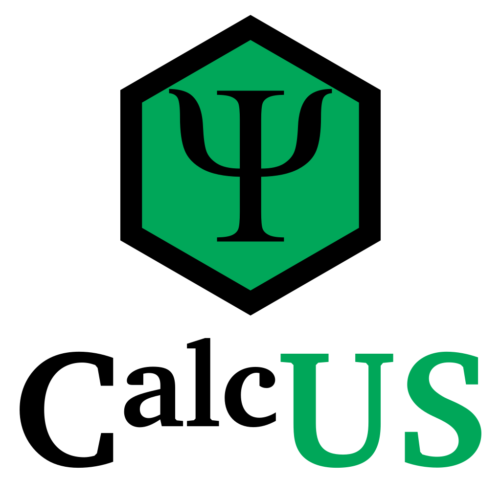

	

# CalcUS - Quantum Chemistry Web Platform
CalcUS is a quantum chemistry plateform. It strives for simplicity, clarity and efficiency. It brings all the necessary tools to perform quantum chemistry in a user-friendly web interface.

This project is developed by the Legault group at the Université de Sherbrooke (Sherbrooke, Canada).

Documentation and an overview of the platform are available on [ReadTheDocs](https://calcus.readthedocs.io/).

## Installation

For licensing reasons, **no QM software package is included with CalcUS.** In order to use CalcUS, you will need either to install the Linux version of a package locally or use the packages on remote clusters. Note however that [xtb](https://github.com/grimme-lab/xtb) is freely available and can be used with CalcUS for fast semi-empirical tight-binding calculations.

### Linux and Mac
Firstly, install and configure [Docker Engine](https://docs.docker.com/engine/install/) and [Docker Compose](https://docs.docker.com/compose/install/). On Linux, it is necessary to create a docker group and to add yourself to it:

<pre>
sudo groupadd docker
sudo usermod -aG docker $USER
newgrp docker
</pre>

Then, clone the repository. In that repository, a file named `.env` will be needed to set the necessary environment variables. The script `generate_env.py` can be used to interactively create that file. Simply run it with the command `python3 generate_env.py` and answer the questions.

### Windows
You will need to install [Docker](https://www.docker.com/). You might also need to install WSL2 when prompted by Docker. Note that Windows 7 (and older versions of Windows) are not supported.

Further configuration of WSL2 is recommended, as it acquires a large amount of RAM by default (much more than necessary). To do so, go to your user profile home (accessible by entering `%USERPROFILE%` in the file explorer) and create a file called `.wslconfig`. This file has the following format:

<pre>
[wsl2]
memory=2GB
processors=2
</pre>

You can of course tweak the parameters to your liking. It will be necessary to restart the Docker service to apply the change.

Then, clone the repository. In that repository, a file named `.env` will be needed to set the necessary environment variables. The script `generate_env.py` can be used to interactively create that file. For convenience, you can simply execute `generate_env.bat` to call this script. You will need [Python](https://www.python.org/downloads/) to execute the script (any version of Python 3 will work). Simply answer the questions to create the environment file.

## Running CalcUS
Once the setup is complete, launch CalcUS using `start.sh` (Linux, Mac) or by executing `start.bat` (Windows). CalcUS is now available in your web browser at the address `localhost:8080`. On Mac, you might need to manually start the docker service if you've just installed it. It will start automatically at boot in the future.

The first startup might take several minutes, as the different services used within CalcUS are being downloaded. The database must also be created and configured. Subsequent startups will be considerably faster. A superuser account will be created with the username specified in the `.env` file. You can use this account as main account, but make sure to change the password if the server is accessible to others.

Also note that the `.env` *contains sensitive information* and should only be accessible by the server administrator.

By default, the startup script will automatically update CalcUS from stable Docker images and remove unused images. If you use Docker other than for CalcUS or do not want this behaviour, you might want to modify the startup script. Moreover, if you would prefer building the Docker image instead of downloading it (500-600 MB), you can use `dev-compose.yml` to build the image with the following commands:

<pre>
docker-compose -f dev-compose.yml build
docker-compose -f dev-compose.yml up
</pre>

Further documentation is available [here](https://calcus.readthedocs.io/).

## Citation
If you use CalcUS in your research, please cite it:

> Raphaël Robidas and Claude Y. Legault, "CalcUS: An Open-Source Computational Chemistry Web Platform", *ChemRxiv*. DOI: 10.26434/chemrxiv-2021-jw10x

## Contributors
**Project lead and main contributor**: Raphaël Robidas

**Contributor to the conception and beta-testing**: Prof. Claude Y. Legault

**Beta-testers**:

+ Léo Hall
+ Joanick Bourret
+ David Lemire
+ Tommy Lussier
+ Louis Schutz

## Dependencies
CalcUS makes use of several third-party softwares. For convenience, all the non-Python packages are redistributed in this repository, along with their license and/or links to their homepage. These packages are however not part of CalcUS itself.

## License
This program is free software: you can redistribute it and/or modify
it under the terms of the GNU General Public License as published by
the Free Software Foundation, either version 3 of the License, or
(at your option) any later version.

This program is distributed in the hope that it will be useful,
but WITHOUT ANY WARRANTY; without even the implied warranty of
MERCHANTABILITY or FITNESS FOR A PARTICULAR PURPOSE. See the
GNU General Public License for more details.

You should have received a copy of the GNU General Public License
along with this program. If not, see https://www.gnu.org/licenses/.

CalcUS - Quantum Chemistry Web Platform

Copyright (C) 2021 Raphaël Robidas

