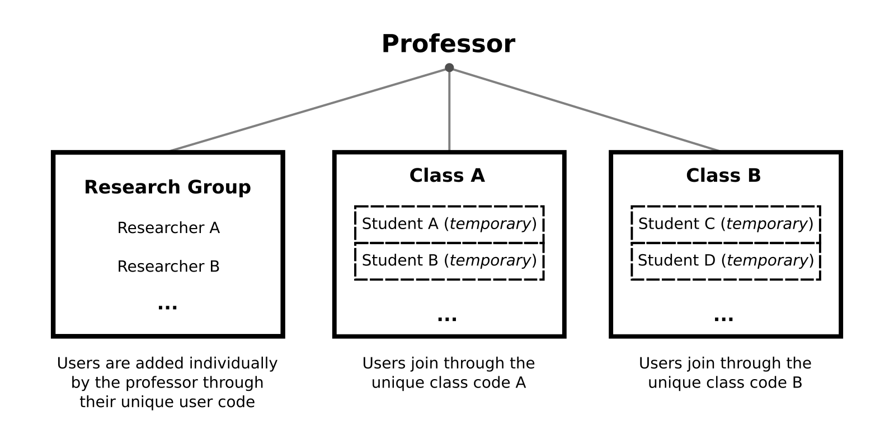

CalcUS Cloud
============

Summary
-------
CalcUS Cloud is a cloud-focused mode of CalcUS. It uses mostly the same features, but changes how user accounts are managed. It currently focuses on using fast xTB calculations for chemical education and teaching practical quantum chemistry. By default, the use of (user-managed) remote computing resources are disabled. Instead, the users use the cloud computing resources preconfigured by the site administrator. 

You can visit `our official CalcUS Cloud website <https://calcus.cloud>`_ and try it for yourself. Alternatively, you can configure your own CalcUS Cloud instance. *Note that we do not offer extensive support for configuring your own Cloud instance. Experience with Cloud application deployment is recommended.*

Calculation Time Allocation
---------------------------

On CalcUS Cloud, each user needs to have a calculation resource allocation in order launch calculations. The CPU time [#1]_ used is recorded for each calculation and added to the user's total usage. Once the user runs out of calculation time, no more calculations can be launched. Resource allocations can be generated by the platform administrator in the form of redeemable codes linked to specific amounts of calculation time.

Research Groups and Classes
---------------------------

Research groups and classes enable users to "sponsor" other users and provide the required calculation time. This means that calculation time used by the sponsored users will be billed to the sponsor.

The two types of groups differ in their purpose and how they work. Research groups are composed of full, permanent user accounts and are added individually by the owner of the group (often, the principal investigator). Members of a research group can view each other's calculations (unless set to private) and use structures from other users as starting points for their own calculations. Research groups are designed for collaboration and transparency within the group.

Classes are geared towards easy use for entire classes in punctual sessions. As such, users do not need to create a full account and be added by the professor. Instead, the professor gives the class code to the students, and they join the class group using this code. This makes the platform much simpler to use for both professors and stufents. However, the student accounts are temporary and have randomly generated emails and passwords. As such, it is not possible to use password recovery through email. Moreover, student accounts and their calculations are only visible to the owner of the class (the professor).

.. [#1] CPU-time is the equivalent total calculation time for one CPU. It corresponds to the number of cores used multiplied by the runtime.
