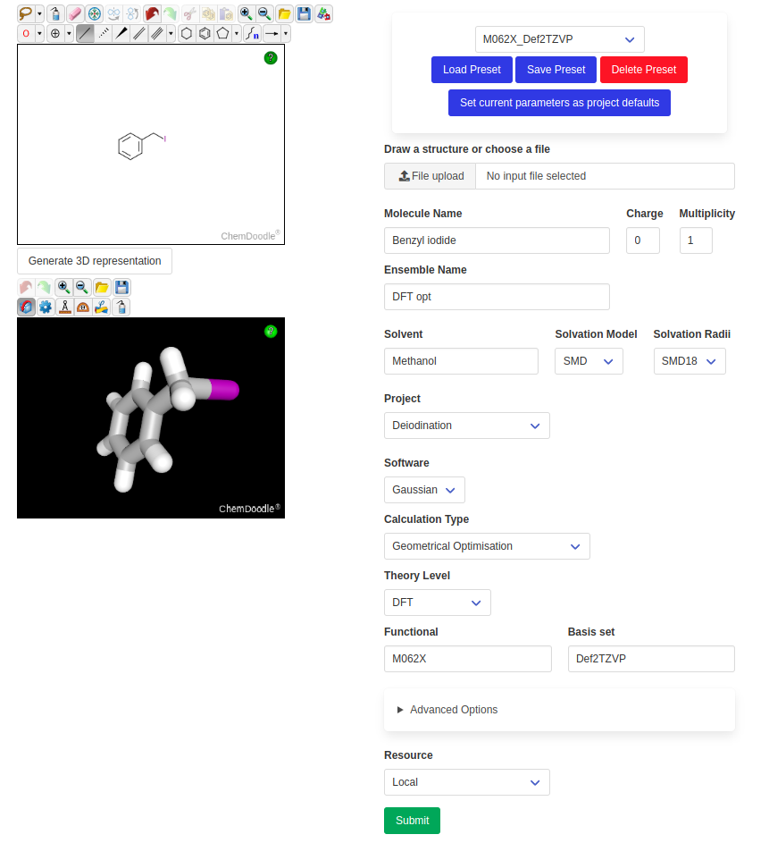
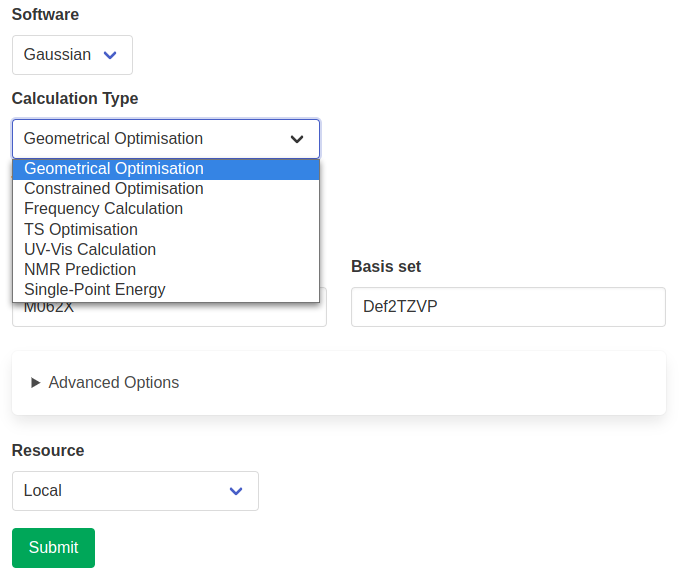
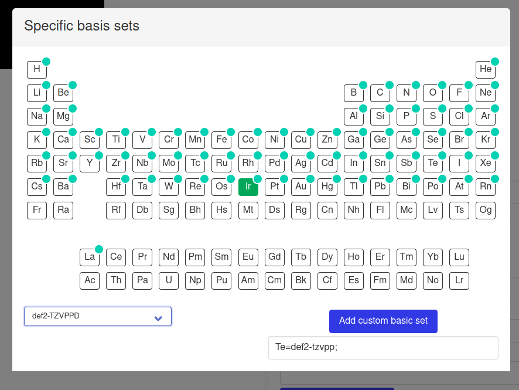
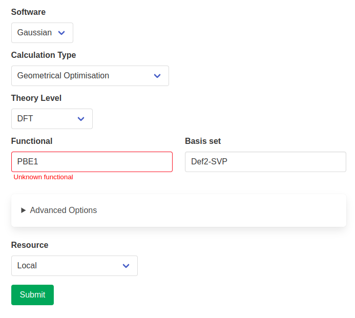
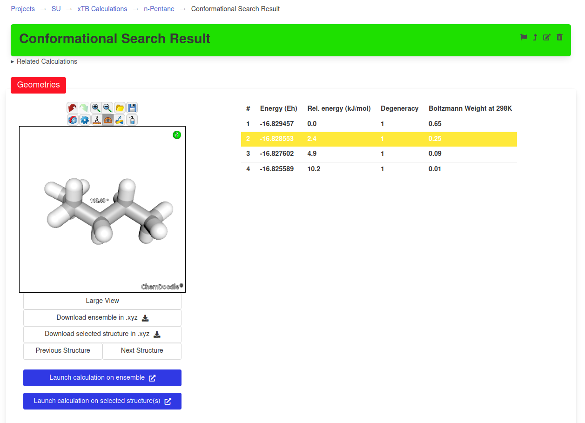
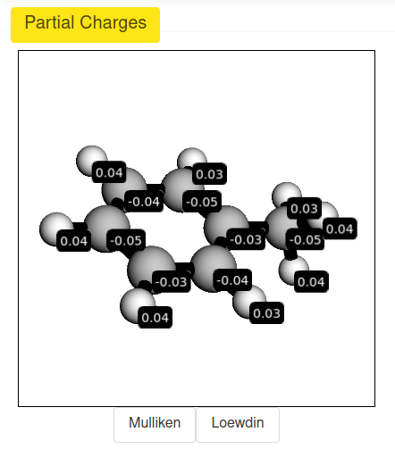
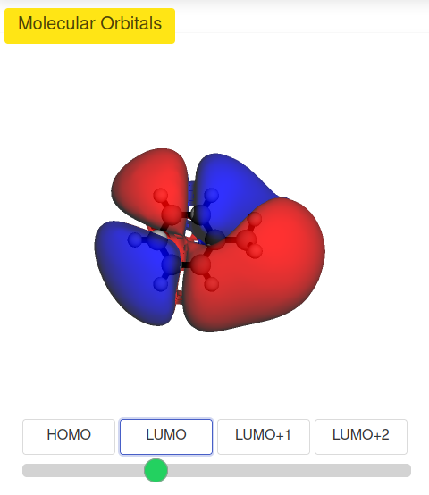
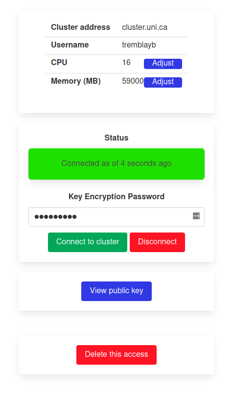
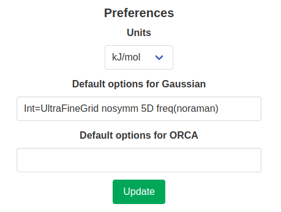

Overview
========

Launching a Calculation
-----------------------

Calculations can be initiated on the "New Molecule" page, which looks like this:

The left side features a `ChemDoodle <https://web.chemdoodle.com/>`_ 2D sketcher and a 3D viewer. The drawn molecules can directly be used as input for the calculation. Alternatively, one or multiple file(s) can be uploaded directly in any common format (.mol, .mol2, .sdf, .xyz, .gjf, .com or as Gaussian .log).

The right side contains all the calculation parameters. These can be saved as presets and loaded in the future. The default parameters of a given project (if they exist) will automatically be loaded when this project is chosen.

Depending on the chosen software, different calculation types are available. Additional parameters might be required and will appear depending on the chosen calculation type.

Advanced options include choosing basis sets on a per-element basis. This is achieved through the use of the `Basis Set Exchange <https://www.basissetexchange.org/>`_ Python library, which provides data about most basis sets in existence. The available options are filtered depending on the chosen elements or basis set. These basis sets will be added to the input file in the appropriate format (if the corresponding element is present in the input structure).

Functionals, basis sets and solvents also benefit from error-checking. The input option is looked up  in the known parameters for the chosen package and a warning is raised if it is not found. This does not prevent you from submitting the calculation, but will reduce the likelihood of time-wasting typos.

Viewing Results
---------------

Once a calculation is successful, the results can be viewed on the page of the corresponding ensemble. For example, after performing a conformational search on n-pentane, the ensemble produced with contain all the conformers that were found.

Depending on the type of calculation, other results will be presented in the appropriate widgets (see examples below).

Remote Access Management
------------------------

The access to remote clusters can be managed individually by the owner. This includes connection/deconnection as well as changing the settings or deleting the access altogether.

Preferences
-----------

Some preferences can be chosen on a per-account basis. This includes the preferred units (Hartrees, kcal/mol or kJ/mol) and default options for some calculation packages. They can be set in the user profile.

The chosen default options will be added to the option line of every input file, except if they are "invalid" for the chosen calculation type. For example, in the figure above, the keyword ``freq(noraman)`` was added to the default options for Gaussian. This skips the calculation of Raman intensities in frequency calculations and overall makes this calculation faster. While this keyword is added to the default options, it will only be added to the input file when a frequency calculation is requested. Options specific to other calculation types are used in the same way.

