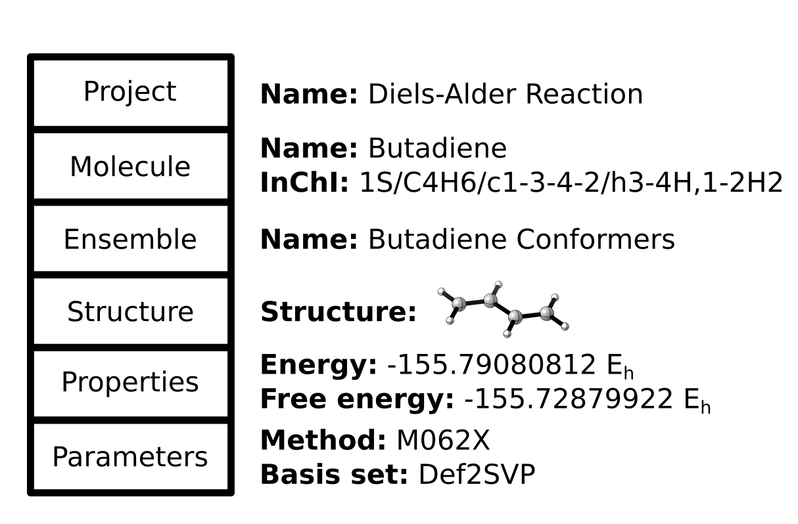
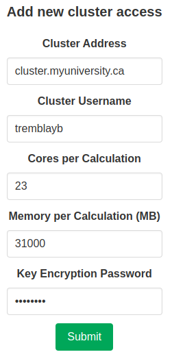

Usage
=====

Calculation Structure
---------------------
CalcUS uses a hierarchy to sort the calculations and their results in a chemically meaningful way.

The topmost level is composed of projects, which should be completely independant. All the results from a project can be downloaded as a single CSV file from the main page. Projects are created when creating a new molecule. You can also pick an existing project to put that molecule into.

Molecules are defined by their atoms and bonds, without considering the exact 3D orientation. When a new molecule is created, its InChI code is determined as to have a unique tag for each molecule. If you create a new molecule which already exists in the project, the results will be merged.

Molecules contain ensembles, which are groups of structures stemming from the same source. If you perform a conformational search, every conformer will be in the same ensemble. In this case, the ensemble represents the true and complete picture of how the molecule will be oriented in space at equilibrium. Here, the ensemble has a thermodynamic meaning. On the other hand, if you performed a constrained optimisation, like scanning a bond distance, an ensemble will be generated to hold all the structures of that scan. In this case, the ensemble itself has no thermodynamic meaning and is just a way of keeping the results organized. Ensembles will also be generated to hold the input structures, either for uploaded structures or drawn structures. These can often be deleted if not needed for further calculations.

Structures are unique positionings of the molecule in space. If a structure is reoptimized at a different theory level, it will generate another structure (as the exact coordinates will change slightly), which will be held in a new ensemble. An entire ensemble can be reoptimized to generated a single new ensemble. Every calculation that changes the coordinates (geometrical optimisation, constrained optimisation, conformer search, transition state optimisation) will generate new structures.

The other calculations which don't change the coordinates will create properties. These are attached to a structure and a particular computational method. On CalcUS, different computational methods will create new tabs on the ensemble page and can be browser through that way. All the properties calculated will appear when you choose a set of parameters. The ensemble properties are calculated from all the structural properties (for example, the Boltzmann-weighted free energy). Structural properties also appear below the ensemble properties and will be updated if you select another structure. The properties do not have to be calculated with the same computational method as the geometries were obtained (although make sure you are interpreting the results correctly!)

Quickstart
----------
You can quickly get started by going to ``New Molecule`` and drawing the molecule you want to study. After choosing a molecule name and new project name, you can choose the type of calculation you want to perform. The fields should generally be filled from the top to the bottom, as choices you make might change the number of options to choose. Make sure you have at least once computing resource to carry out the calculation (see below). After submitting your calculation, you will be taken back to the home page, where your new project will be created. You can view the calculation's status by going to ``Calculations``. Once it is done, you can click directly on the calculation order to be taken to the molecule's page and browse through the results.

Local Calculations
------------------

User Access
^^^^^^^^^^^

To launch calculations directly on the server, you must either be the Principal Investigator (PI) of a research group,  belong to such a group, or be a superuser. Once one of these conditions are met, you will have access to the "Local" resource on the calculation launching page.

If you are a newly registered PI, you can make a request to create your group in your profile. The site's administrator will have to approve your request, so contact him or her to validate your identity and accelerate the process. You will then be able to add members with their username and unique code (which is generated upon account creation.) 

If you are a newly registered student, send your username and unique code to your PI to be added to their group.

Calculation Packages
^^^^^^^^^^^^^^^^^^^^

To perform local calculations, you need at least one calculation package available on your computer *in its Linux version* (see :ref:`software-packages:Supported Packages`). Moreover, the path to the directory directly containing the package must be specified during the ``.env`` file creation. If these two conditions are met, you will be able to choose the calculation package and the local resource when launching a new calculation. Note however that this does not guarantee that the package is fully functional, only that it is properly detected by CalcUS.

Remote Calculations
-------------------

CalcUS can also use external computing resources. The process of launching calculations is exactly the same as for local calculations, except that the external computing resource must be selected in the "Resource" field. Once the calculations are done, the results will be parsed from the remote server, analysed and added to your project. Local calculations can also be used as starting points for calculations on other resources, as every calculation is independant of the resource used.

Before launching calculations, you will need to configure the resource a bit. Firstly, create a folder named "calcus" in your remote home on the cluster via SSH (the full path should be ``/home/<username>/calcus``). 

If you plan to run xtb calculations, make sure that the following programs are available:

* `xtb <https://github.com/grimme-lab/xtb/releases>`_
* `crest <https://github.com/grimme-lab/crest/releases>`_
* `xtb4stda <https://github.com/grimme-lab/stda/releases>`_
* `stda <https://github.com/grimme-lab/stda/releases>`_

The easiest way to get the files is to use the ``wget`` command directly from the cluster. While in a suitable directory (somewhere in your ``$HOME``, typically), run ``wget <link>`` to download each archive. Make sure that you use the direct URL to the archive or program (*e.g.* it should end in ``.tar.xz`` or ``.tgz`` for the archives.) Afterwards, unpack the archives (*e.g.* ``tar xvf <archive.tar.xz>`` or ``tar zxvf <archive.tgz>``). You should add the full paths to the directories *directly containing the binaries* to your ``$PATH`` in ``~/.bashrc``. For example, to add the main ``xtb`` program, you might have this line in your ``.bashrc``: 

.. code-block:: bash
        :caption: ~/.bashrc

        [...]
        export PATH=$PATH:/home/rtremblay/binaries/xtb-X.Y.Z/bin
        [...]

Make sure that every binary file is executable. If they are not, you can make them executable by executing the command ``chmod 700 <binary>``. You will also need the parameter files for ``xtb`` and ``xtb4stda`` (named ``.param_...``). You will find them in the Github repositories (`here <https://github.com/grimme-lab/xtb4stda>`__ and `here <https://github.com/grimme-lab/xtb>`__); they can be simply dropped in your home directory.

Then, for any software, you will need to supply sample submission scripts. As of right now, only the SLURM cluster manager is supported. You need to provide one submission script per software, named ``submit_<software>.sh`` (be careful of the capitalization in the software name) and located in your calcus folder. For ``xtb`` and other related programs, the script might look like this:

.. code-block:: bash
        :caption: submit_xtb.sh

        #!/bin/bash
        #SBATCH --output=%x-%j.log
        #SBATCH --account=def-mygroup
        #SBATCH --time=168:00:00
        #SBATCH --nodes=1
        #SBATCH --ntasks=24
        #SBATCH --mem=31000M

        export OMP_NUM_THREADS=24.1
        export OMP_STACKSIZE=1G

        cd $SLURM_SUBMIT_DIR

And for ORCA, it might look like this:

.. code-block:: bash
        :caption: submit_ORCA.sh

        #!/bin/bash
        #SBATCH --output=%x-%j.log
        #SBATCH --account=def-mygroup
        #SBATCH --time=168:00:00
        #SBATCH --nodes=1
        #SBATCH --ntasks=24
        #SBATCH --mem=31000M

        module load nixpkgs/16.09  gcc/7.3.0  openmpi/3.1.2 orca/4.2.0

        cd $SLURM_SUBMIT_DIR

CalcUS will automatically append the correct command to this file when submitting a calculation. The job name will be set to ``CalcUS-XXXX``, where ``XXXX`` is the job id in CalcUS.

If you use `Pysisyphus <https://github.com/eljost/pysisyphus>`_ as calculation driver, you will need to `create a Python virtual environment <https://docs.python.org/3/library/venv.html>`_ with ``pysisyphus`` (and its dependencies) already installed. This virtual environment should be activated in the submission script by adding this line to it: ``source /home/user/<env_path>/bin/activate``. Python 3.10 or higher is recommended.

The final step is adding the access on CalcUS. To do that, go on your profile page and enter the correct information about the remote resource you want to add, then click "Submit". *The encryption password can and should be different from both your CalcUS password and especially the password of your account on the cluster.* Note that you should enter the number of cores and memory that you want to use for remote calculations, not necessarily the number of cores and memory that are available per node. For example, on nodes that have 32 cores and 128000 MB of memory, you might want to only use 16 cores and 64000 MB of memory. These parameters will be used in the input files to calculation softwares (Gaussian, ORCA, xtb). You still need to specify the appropriate values in the submission scripts (see above). When performing Gaussian calculations, it can be useful to specify a lower amount of memory in the input file than is actually available to you in order to prevent out of memory crashes. This can be done by requesting the maximum amount of memory in the bash input script, but choosing a value 1000 MB or 2000 MB lower in the access parameters in CalcUS.

You will be given a public key to add to your authorized keys (in ``/home/<username>/.ssh/authorized_keys``) on the remote server. Once that is done, click "Manage" on the corresponding entry in the "Owned accesses" table. Click "Test connection" to initiate the connection between CalcUS and the cluster. If everything goes well, the status of the access will become "Connected". You will then be able to use this resource when launching calculations.

You may observe a small delay between the completion of remote jobs on the cluster and the job appearing as such in CalcUS (around 10 minutes at most). This is because CalcUS must periodically check the status of submitted jobs, which is done every couple minutes. It may take some additional time to download and analyze the results, especially if many calculations finish at the same time.

